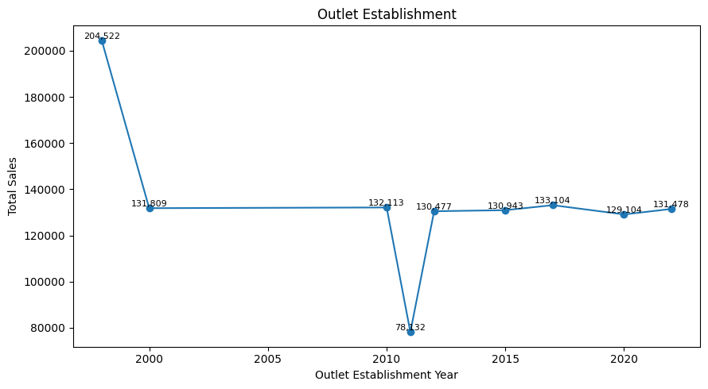
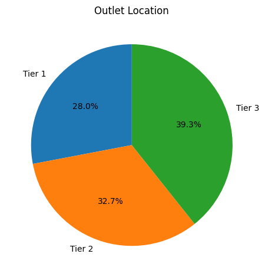
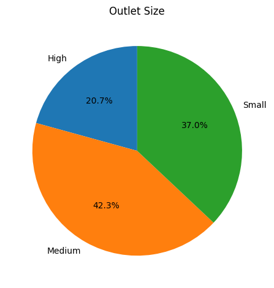
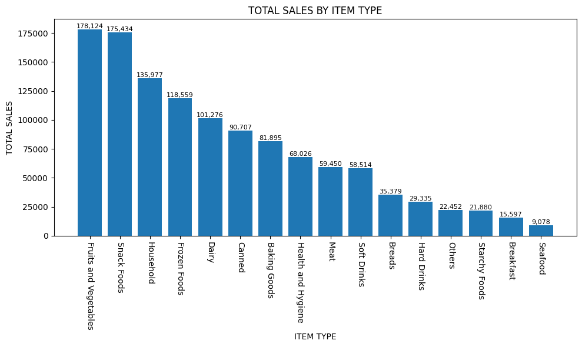
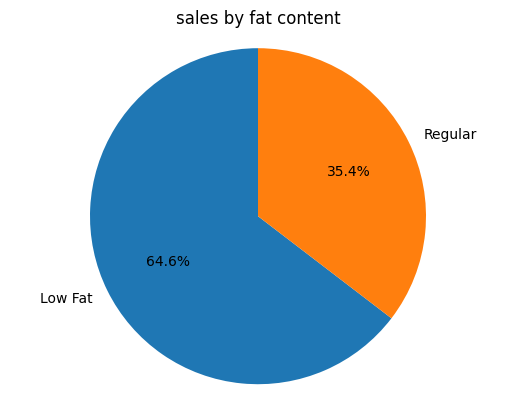
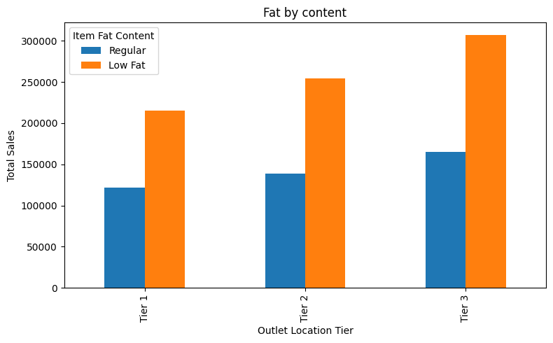

# Blinkit Data Analysis

## Project Overview
This project performs end-to-end data analysis on Blinkit retail sales data using Python and Pandas.
The objective is to analyze sales performance across different outlet types, locations, item categories,
and fat content to derive meaningful business insights.

## Dataset
- The dataset contains item-level and outlet-level sales information.
- Key columns include Item Type, Item Fat Content, Outlet Size, Outlet Location Type, Sales, and Rating.

## Tools & Technologies
- Python
- Pandas
- NumPy
- Matplotlib
- Jupyter Notebook

## Project Structure
blinkit-data-analysis/
├── data/
│ └── blinkit_data.csv
├── images/
├── notebook/
│ └── Blinkit-Analysis.ipynb
└── README.md

## Visual Insights
### Sales by Outlet Establishment Year

### Sales by Outlet Location

### Sales by Outlet Size

### Sales by Item Type

### Sales by Item Fat Content

### Fat Content by Outlet

## Key Insights
- Supermarket outlets generate higher total sales compared to grocery stores.
- Low-fat products contribute a significant share of overall sales.
- Outlet establishment year does not always correlate with higher sales.
- Certain item types consistently outperform others across outlet sizes and locations.

## How to Run the Project
1. Clone the repository
2. Install dependencies using `pip install -r requirements.txt`
3. Open the notebook in the `notebook` folder
4. Run all cells to reproduce the analysis

